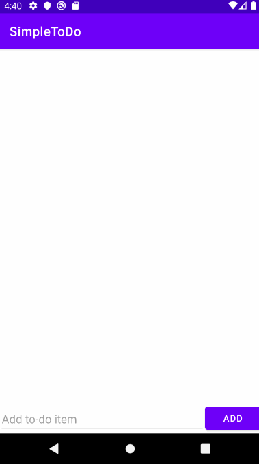

# Project 1 - *Simple ToDo*

**Simple ToDo** is an android app that allows building a todo list and basic todo items management functionality including adding new items, editing and deleting an existing item.

Submitted by: **Meghan Lin**

Time spent: **5** hours spent in total

## User Stories

The following **required** functionality is completed:

* [x] User can **view a list of todo items**
* [x] User can **successfully add and remove items** from the todo list
* [x] User's **list of items are persisted** across app restarts

The following **bonus** features are implemented:

* [ ] User can **tap a todo item in the list and bring up an edit screen for the todo item** and then have any changes to the text reflected back in the todo list

The following **additional** features are implemented:

* [x] User is not allowed to add an empty item to the list

## Video Walkthrough

Here's a walkthrough of implemented user stories:

GIF created with [Kap](https://getkap.co/).

## Notes

It took a while to figure out how to use the design view of the xml file, as I was unable to move my button, but replacing the button solved the issue.

I added the simple extra functionality of disallowing the user from adding a blank item to the list, as it seemed like a logical extension to the tutorial.

## License

    Copyright 2021 Meghan Lin

    Licensed under the Apache License, Version 2.0 (the "License");
    you may not use this file except in compliance with the License.
    You may obtain a copy of the License at

        http://www.apache.org/licenses/LICENSE-2.0

    Unless required by applicable law or agreed to in writing, software
    distributed under the License is distributed on an "AS IS" BASIS,
    WITHOUT WARRANTIES OR CONDITIONS OF ANY KIND, either express or implied.
    See the License for the specific language governing permissions and
    limitations under the License.
